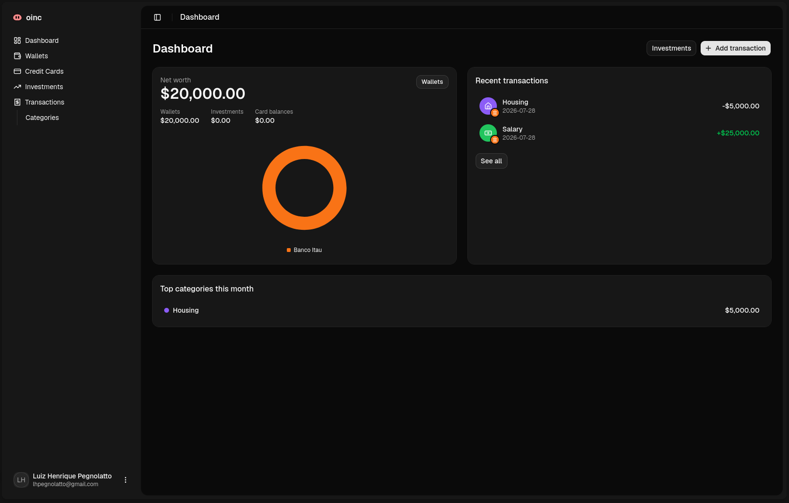

<div align="center">
  

  # oinc
</div>

**Simple, fast personal finance — see where your money is and where it's going, without becoming a bookkeeper.**

oinc is a personal finance app covering wallets, transactions, credit cards, and investments as one connected picture. It's built as a production-shaped Turborepo monorepo (Next.js + Hono + Postgres) developed through a **spec-driven, AI-assisted workflow** — every feature ships as a proposal → design → tasks → implementation cycle, kept consistent by a documented architecture and enforced by real, use-case-driven tests.



---

## Table of contents

- [Why this project](#why-this-project)
- [AI-driven development](#ai-driven-development)
- [Architecture](#architecture)
- [Tech stack](#tech-stack)
- [Testing](#testing)
- [Getting started](#getting-started)
- [Project structure](#project-structure)
- [Engineering conventions](#engineering-conventions)

---

## Why this project

Most people don't have a spending problem — they have a *visibility* problem. Money is split across a wallet, a couple of credit cards, and maybe a brokerage account, and none of it is in one place. Spreadsheets and full accounting suites cost more effort to maintain than the insight is worth.

oinc's bet: if logging and reviewing money takes seconds, people actually keep doing it. That drives two hard product constraints, not just nice-to-haves:

- **Simple, not comprehensive** — no double-entry ledgers, no multi-currency consolidation, no tax reporting. If a feature adds bookkeeping-grade complexity without helping one person understand their own money, it's cut.
- **Speed is a feature** — the highest-frequency action (logging a transaction) opens in a sheet over the current screen, not a page navigation, and is bound to a keyboard shortcut. Every new frequent action is held to the same bar.

## AI-driven development

This repo is built end-to-end with [Claude Code](https://claude.com/claude-code) using [OpenSpec](https://github.com/Fission-AI/OpenSpec), a **spec-driven change workflow**, rather than ad-hoc prompting:

```
openspec/
├── config.yaml     # project context injected into every AI-generated artifact
├── changes/        # proposal.md → design.md → tasks.md per change, then archived
│   └── archive/    # 13 shipped changes, e.g. wallets-crud, credit-card-statements,
│                    # net-worth-aggregation, user-provisioning...
└── specs/          # living specs per capability, kept in sync as changes land
```

Every feature goes through the same cycle before a line of implementation code is written:

1. **Propose** — describe the change; a proposal + design doc + task list are generated against the project's actual architecture and product constraints (`.docs/architecture/`, `.docs/product/`), not generic best practices.
2. **Design review** — architectural deviations (a different pattern, an exception to a module boundary) must be called out explicitly with a rationale, not silently introduced.
3. **Implement** — tasks are worked one at a time; every task list is required to include the *use cases* being tested, not just "implement X".
4. **Sync & archive** — specs are updated to reflect what shipped, and the change is archived, so `openspec/specs/` always reflects current behavior instead of drifting from it.

This keeps AI-assisted velocity honest: the model isn't just generating code, it's held to the same architectural rules (module boundaries, CQRS split, error contract, index-per-column conventions) on every single change, documented in [.docs/architecture/](.docs/architecture) and enforced via project-specific [Claude Code skills](.claude/skills) (`backend-patterns`, `shadcn`) plus the `openspec-*` workflow skills.

## Architecture

Turborepo monorepo, Bun runtime/package manager/test runner, two apps sharing a validated env package:

```
oinc/
├── apps/
│   ├── web/            # Next.js (App Router) frontend
│   └── api/             # Bun + Hono backend API
├── packages/
│   └── env/              # @oinc/env — shared t3-env schemas (client + server)
├── turbo.json
└── biome.json           # single linter/formatter for the whole repo
```

### Backend (`apps/api`) — modular, Clean Architecture, CQRS

```
apps/api/src/
├── app/                    # Hono app wiring, route aggregation, exports AppType
├── modules/
│   └── <module>/            # wallets, transactions, credit-cards, investments, categories, users
│       ├── controllers/     # parse/validate input, call a command/query, shape response
│       ├── commands/        # write use cases — go through the domain layer
│       ├── queries/          # read use cases — optimized, can bypass the domain model
│       ├── repositories/     # Drizzle-backed persistence
│       ├── domain/            # entities/value objects/domain errors, framework-agnostic
│       └── schemas/            # Zod DTOs
└── shared/
    ├── db/                  # Drizzle client + schema
    ├── auth/                 # Better Auth instance + requireAuth middleware
    ├── errors/                # domain errors → { error: { code, message, details } } contract
    └── middleware/             # logging, request id, global error handler
```

- **Modules never reach into each other's internals** — no module imports another module's `repositories/`, `commands/`, or `domain/` directly; composition happens at the controller layer or through an explicit shared contract.
- **CQRS boundary is real, not aspirational** — controllers call exactly one command or query, never a repository directly.
- **Routes are public by default**, guarded explicitly per-router with a `requireAuth` middleware — mirrors the frontend's route-group split below.

### Frontend (`apps/web`) — routing vs. logic split

```
apps/web/src/
├── app/                        # routing ONLY — layouts, route groups, no feature logic
│   ├── (public)/                # no session required (marketing, /login)
│   └── (private)/                # session enforced at the layout level
└── modules/
    └── <module>/                 # wallets, transactions, credit-cards, investments, dashboard
        ├── components/
        ├── hooks/                  # TanStack Query hooks
        ├── schemas/                 # view-only Zod schemas
        └── api.ts                   # Hono RPC client calls
```

- **End-to-end type safety with zero codegen** — `apps/api` exports its Hono app's type (`AppType`), and `apps/web` consumes it through Hono's RPC client (`hc`). No hand-written `fetch` calls, no duplicated Zod schemas for API-shaped data, and no runtime coupling — the import is erased at build time.
- **Auth boundary mirrors the API** — `app/(private)/layout.tsx` checks the session server-side and redirects to `(public)/login`, the same "public by default, opt-in private" model as `requireAuth` on the backend.

### Data & auth

- **PostgreSQL** via **Drizzle ORM**, migrations generated with `drizzle-kit`. Every foreign key / filtered / sorted / unique column carries a matching index as part of the schema definition, not an afterthought.
- **Better Auth**, Google sign-on only (`emailAndPassword` explicitly disabled, not just unused) — a new user's first Google sign-in provisions their account via a database hook into `modules/users`.

## Tech stack

| Layer | Choice |
|---|---|
| Monorepo | Turborepo, Bun (runtime + package manager + test runner) |
| Lint/format | Biome (single tool, replaces ESLint + Prettier) |
| Frontend framework | Next.js (App Router) |
| Styling / UI | Tailwind CSS, shadcn/ui (`nova` preset, base-ui primitives) |
| Frontend state | TanStack Query (server state), React Hook Form + Zod (forms) |
| Backend framework | Hono on Bun |
| API ↔ Web contract | Hono RPC (`hc`) — types inferred from `AppType`, no codegen |
| ORM / DB | Drizzle ORM, PostgreSQL |
| Auth | Better Auth (Google OAuth only) |
| Validation | Zod, shared between Hono (`@hono/zod-validator`) and forms |
| Env validation | `@oinc/env` (`@t3-oss/env-core` / `@t3-oss/env-nextjs`) — `process.env` is never read directly in app code |
| E2E testing | Playwright |

## Testing

Testing philosophy: tests describe **use cases and user flows**, not implementation details — coverage is a side effect of testing real behavior, never the goal. A test that only exercises a pure function for inputs no real flow produces is treated as an anti-pattern, not a win.

| Suite | Scope | Volume |
|---|---|---|
| `apps/api` — `bun test` | Commands/queries/controllers against a **real Postgres**, not mocks | 11 test files, 130+ use-case assertions |
| `apps/web` — `bun test src` | Server-rendered output & route/auth guarding, via real `next dev` + `apps/api` processes | 6 test files |
| `apps/web/e2e` — Playwright | Client-side interaction (dialogs, forms, confirm-gated deletes) against real dev servers | 7 spec files, ~48 scenarios |

Notable choices:

- **No mocked database.** `apps/api` tests run against a real Postgres instance (a second `oinc_test` database in the same local Docker container). Isolation is **per-test transaction rollback**, not truncation — each test opens a transaction, runs, and rolls back, so tests can run concurrently without cross-test pollution. This is also why repositories take an injected `db`/transaction handle instead of importing a singleton client.
- **Two frontend tiers, chosen per use case**: a `bun test` tier for anything a static `fetch()`/HTML assertion can verify (redirects, server-rendered content, auth gating), and Playwright for anything that only exists after hydration (form validation, dialogs, client interaction).
- **No CI yet — deliberately.** This is a solo-maintained repo at this stage; the gate is `bun run lint && bun test && bun run build` run locally before any change is considered done. Called out explicitly rather than left as a silent gap.

## Getting started

Prerequisites: [Bun](https://bun.sh) 1.3+, Docker (for local Postgres), a Google OAuth client (for sign-in).

```bash
# 1. Install dependencies across the whole workspace
bun install

# 2. Start Postgres (dev + test databases)
docker compose up -d

# 3. Configure environment variables
cp apps/api/.env.example apps/api/.env       # DATABASE_URL, GOOGLE_CLIENT_ID/SECRET, BETTER_AUTH_SECRET, WEB_APP_URL
cp apps/web/.env.example apps/web/.env       # NEXT_PUBLIC_API_URL

# 4. Run both apps (Turborepo fans this out to apps/web + apps/api)
bun run dev
```

```bash
# Before considering any change done (no CI yet — this is the gate):
bun run lint && bun test && bun run build

# Frontend end-to-end tests (needs Postgres + dev servers running):
cd apps/web && bun run test:e2e
```

## Project structure

```
oinc/
├── apps/
│   ├── web/                 # Next.js frontend — see Architecture above
│   │   ├── src/app/           # routing only
│   │   ├── src/modules/       # feature logic
│   │   └── e2e/                # Playwright specs
│   └── api/                  # Hono backend — see Architecture above
│       ├── src/app/            # Hono app wiring
│       ├── src/modules/        # wallets, transactions, credit-cards, investments, categories, users
│       └── src/shared/          # db, auth, errors, middleware
├── packages/
│   └── env/                  # shared env-variable schemas
├── .docs/
│   ├── architecture/          # authoritative tech-stack & architecture decisions
│   └── product/                # vision, scope, non-goals, roadmap
└── openspec/                 # spec-driven change workflow (see AI-driven development)
```

## Engineering conventions

A few constraints kept deliberately non-negotiable across every change (full detail in [.docs/architecture/](.docs/architecture)):

- Business logic lives in `src/modules/<name>/` on both apps — `app/` is routing only.
- `apps/api` modules never import another module's `repositories/`, `commands/`, or `domain/` directly.
- Auth is Google sign-on only; `emailAndPassword` stays disabled.
- Every API error is shaped as `{ error: { code, message, details } }` — no controller hand-builds an error body.
- Every FK / filtered / sorted / unique column gets a matching Drizzle index in the same schema file.
- `process.env` is never read directly — everything goes through `@oinc/env`.
- Biome is the only linter/formatter in the repo.
